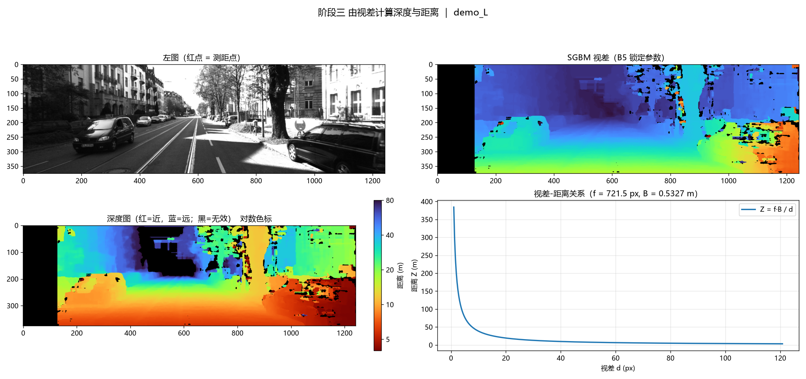
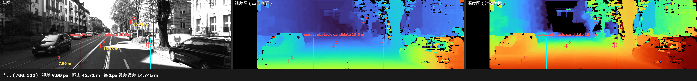

# 阶段三视差转换为深度结果分析

## 1. 实验目的

我在阶段二完成了最终参数B5的独立评测。本阶段不再调整SGBM参数，而是使用B5计算左图视差，并结合KITTI相机标定参数将视差换算为深度，从而得到图像中各位置到左相机的估计距离。

本阶段还实现了指定像素测距和鼠标点击测距，用于直观查看某个图像位置的视差、估计距离以及视差误差对距离的影响。

## 2. 输入数据

本次演示使用KITTI Stereo 2015训练集中的 `000000_10` 场景，包括：

- `image_2/000000_10.png`：左相机图像；
- `image_3/000000_10.png`：右相机图像；
- `disp_noc_0/000000_10.png`：左图坐标系下的非遮挡视差真值；
- `calib_cam_to_cam/000000.txt`：相机标定文件。

左右图像的尺寸均为1242×375像素，输入图像已经由KITTI完成立体校正，可以直接用于SGBM视差计算。

## 3. 标定参数与深度公式

我从标定文件中的左、右彩色相机投影矩阵 `P_rect_02` 和 `P_rect_03` 提取了深度计算所需的参数：

| 参数 | 数值 | 含义 |
| --- | ---: | --- |
| 焦距 $f$ | 721.5377 px | 相机在水平方向上的像素焦距 |
| 基线 $B$ | 0.5327254 m | 左右相机光心之间的距离 |
| $fB$ | 384.3815 px·m | 焦距与基线的乘积 |

深度使用下面的公式计算：

$$
Z=\frac{fB}{d}
$$

其中，$Z$为深度，单位是米；$d$为SGBM计算出的视差，单位是像素。

这说明视差与深度成反比：同一套相机参数下，视差越大，物体通常越近；视差越小，物体通常越远。

## 4. 深度计算与有效范围

本次计算只保留大于0的有效视差，并将最大深度设置为80米。视差无效、计算结果异常或深度超过80米的位置均作为无效区域处理。

最终得到374087个有效深度像素，占整幅图像的80.3193%。有效深度范围约为3.18～79.87米。

深度结果保存为两种数据格式：

| 文件 | 数据形式 | 单位 | 无效位置 |
| --- | --- | --- | --- |
| `depth_m.npy` | `float32`浮点数组 | 米 | `NaN` |
| `depth_cm_16bit.png` | 16位无符号整数图像 | 厘米 | 0 |

`depth_m.npy`保留完整的浮点精度，适合后续程序继续计算；`depth_cm_16bit.png`便于使用常见图像工具保存和读取。厘米图在本次结果中的最大值为7987厘米，没有出现数值截断。由于厘米图会舍去不足1厘米的小数部分，它与浮点深度之间最多相差约0.01米。

彩色深度图只用于观察，红色表示距离较近，蓝色表示距离较远，黑色表示无效区域。实际距离应从 `depth_m.npy` 或 `depth_cm_16bit.png` 中读取，不能根据显示颜色直接判断精确数值。



## 5. 指定位置测距结果

我选取了三个像素位置进行测距：

| 像素位置 | 视差 | 估计深度 | 1 px视差误差对应的深度变化 | 真值深度 |
| --- | ---: | ---: | ---: | ---: |
| (300, 330) | 48.6875 px | 7.8949 m | 0.1622 m | 7.9299 m |
| (540, 250) | 24.1250 px | 15.9329 m | 0.6604 m | 无点位真值 |
| (700, 120) | 9.0000 px | 42.7091 m | 4.7455 m | 无点位真值 |

位置 `(300, 330)` 的估计深度与真值深度相差约0.035米。其余两个位置在KITTI视差真值图中为0，表示该像素没有提供真值，不能据此计算测距误差，并不代表真实视差或真实距离为0。

三个测距点也反映了远距离测量更敏感的原因：约7.9米处的1像素视差误差对应约0.16米深度变化，而约42.7米处会对应约4.75米深度变化。因此，远处只有很小的视差时，即使视差误差不大，换算后的距离误差也可能明显增大。

鼠标点击测距与指定坐标测距使用相同的计算方法。点击左图、视差图或深度图中的位置后，程序会显示该位置的视差、估计深度和每1像素视差误差对应的深度变化。



## 6. 深度真值对比

我使用 `disp_noc_0` 中的非遮挡视差真值换算真值深度，并在“同时具有真值和有效预测”的像素上比较估计深度。本场景共有87712个非零真值像素，其中82454个位置同时得到了有效深度，真值区域的深度输出率为94.0054%。

| 真值距离区间 | 比较像素数 | 平均绝对误差 | 中位绝对误差 | 平均相对误差 |
| --- | ---: | ---: | ---: | ---: |
| 0～10 m | 34443 | 0.1889 m | 0.0722 m | 2.1183% |
| 10～20 m | 32164 | 0.5552 m | 0.1921 m | 4.0688% |
| 20～30 m | 7090 | 2.0670 m | 0.9458 m | 8.1319% |
| 30～50 m | 6855 | 3.5827 m | 1.7094 m | 9.5264% |
| 50 m以上 | 1902 | 4.9599 m | 3.6934 m | 8.4715% |
| 全部 | 82454 | 0.8855 m | 0.1415 m | 4.1587% |

在参与比较的有效像素中，整体平均绝对误差为0.8855米，中位绝对误差为0.1415米。近距离区域的误差较小，距离增加后绝对误差总体上升，这与视差和深度之间的反比例关系一致。

这些指标只统计同时具有真值和有效预测的位置，没有把SGBM未输出有效视差的位置计入误差。因此，它们反映的是有效输出区域的深度误差，不等同于整幅图像的严格深度准确率。

## 7. 前方障碍候选

程序还在图像下方中央的兴趣区域内进行了前方障碍候选估计。本场景得到的候选距离为15.5306米，对应视差24.75像素，候选位置为 `(798, 243)`。

该结果来自“逐行估计路面视差，再寻找明显高于同行路面视差的区域”这一简单规则。它可以作为距离计算的扩展示例，但没有进行物体识别，也没有使用障碍物标注验证，所以只能称为障碍候选，不能将15.5306米解释为已经确认的最近障碍物距离。

## 8. 结果文件说明

| 文件 | 内容 |
| --- | --- |
| `depth_m.npy` | 单位为米的完整精度深度数据 |
| `depth_cm_16bit.png` | 单位为厘米的16位深度数据 |
| `depth_color.png` | 便于观察远近关系的彩色深度图 |
| `panels.png` | 左图、SGBM视差、深度图和视差—距离曲线 |
| `interactive_preview.png` | 点击测距功能的预览结果 |
| `samples.csv` | 指定测距点的视差、深度、真值及误差 |
| `accuracy.csv` | 按真值距离分层统计的有效区域深度误差 |
| `obstacle.csv` | 兴趣区域内的障碍候选计算结果 |

## 9. 实验结论

本阶段完成了从KITTI标定文件读取焦距和双目基线、使用锁定的B5参数计算视差、将视差转换为深度、过滤无效深度、保存深度数据以及点击测距的完整流程。

结果验证了视差与距离的反比例关系，也说明深度误差会随着目标距离增加而更加明显。近距离测距结果较稳定，远距离测量则更容易受到小幅视差误差的放大影响。

本次结果只来自一个KITTI场景，主要用于验证深度计算流程和测距功能是否正确，不能代表整个KITTI数据集上的深度精度。最终深度仍然依赖SGBM视差质量，在遮挡边缘、弱纹理、反光区域和远距离区域可能出现空洞或较大误差。

## 10. 数据来源

本分析使用以下结果文件：

```text
results/depth_demo_L/depth_m.npy
results/depth_demo_L/depth_cm_16bit.png
results/depth_demo_L/depth_color.png
results/depth_demo_L/panels.png
results/depth_demo_L/interactive_preview.png
results/depth_demo_L/samples.csv
results/depth_demo_L/accuracy.csv
results/depth_demo_L/obstacle.csv
```
