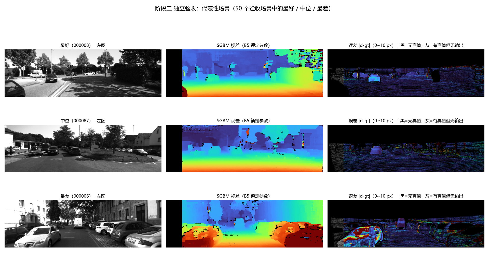
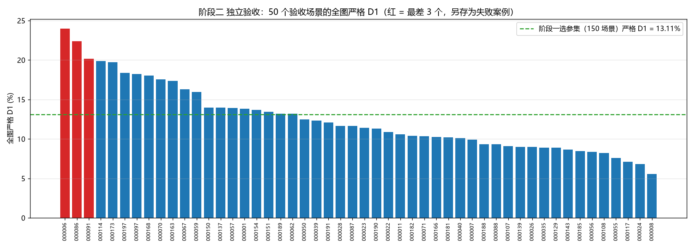

# 阶段二独立评测结果分析

## 1. 评测目的

我在阶段一使用150个选参场景完成了SGBM参数实验，最终得到配置B5。阶段二不再比较或调整参数，而是直接把B5应用到另外50个没有参与选参的场景中，检查这组参数在新图像上的表现。

整个评测过程中，SGBM参数均从 `configs/sgbm.yaml` 读取并保持不变。因此，本阶段的结果反映的是B5的泛化表现，而不是继续调参后的结果。

## 2. 数据与参数

选参组与验收组来自KITTI Stereo 2015训练集，两组之间没有重复场景：

| 数据组 | 场景数 | 用途 |
| --- | ---: | --- |
| 选参组 | 150 | 阶段一选择参数 |
| 验收组 | 50 | 阶段二独立评测 |

50个验收场景均包含左图、右图、非遮挡视差真值和含遮挡视差真值，没有缺失文件。

本次评测使用的B5参数如下：

| 参数 | 取值 |
| --- | ---: |
| `minDisparity` | 0 |
| `numDisparities` | 128 |
| `blockSize` | 9 |
| `P1` | 1296 |
| `P2` | 5184 |
| `disp12MaxDiff` | 128 |
| `preFilterCap` | 63 |
| `uniquenessRatio` | 0 |
| `speckleWindowSize` | 100 |
| `speckleRange` | 2 |
| `mode` | `SGBM_3WAY` |

## 3. 评测口径

本次以 `disp_noc_0` 非遮挡真值作为主要评测依据，并使用 `disp_occ_0` 补充观察含遮挡区域的表现。真值为0的位置没有可用参考答案，不参与误差统计。

- 公共区域D1：统一排除图像左侧128列后计算，无效输出按错误计入；
- 全图严格D1：在全部有效真值位置计算，无效输出按错误计入；
- 有效区域D1：只在同时具有真值和有效预测的位置计算；
- D1（含遮挡）：使用 `disp_occ_0` 计算的全图严格D1；
- EPE：预测视差与真值视差的平均绝对误差；
- 有效视差比例：算法输出有效视差的像素占整张图像的比例（按 `d ≥ 0` 统计，含 `d = 0` 的像素；这类像素约占 1.1%～1.4%，计入覆盖率但不能用于测距）；
- 真值区域有效率：在具有真值的位置中，算法成功输出视差的比例；
- 运行速度：每个场景先预热一次，再运行3次并取中位耗时。

## 4. 总体结果

| 指标 | 阶段二结果 |
| --- | ---: |
| 公共区域D1 | 7.1300% |
| 全图严格D1 | 12.5064% |
| 有效区域D1 | 6.0592% |
| D1（含遮挡） | 14.0323% |
| EPE | 3.7838 px |
| 有效区域EPE | 1.4521 px |
| 中值误差 | 0.5977 px |
| 有效视差比例 | 87.6543% |
| 真值区域有效率 | 93.1370% |
| 场景D1中位数 | 11.5244% |
| 场景D1 P90 | 18.4912% |
| 最差场景D1 | 24.0000% |
| 单帧中位耗时 | 0.0387 s |
| FPS | 25.84 |

公共区域D1为7.1300%，说明排除搜索范围造成的左侧固定无效区域后，B5在验收组上的主要误匹配率较低。全图严格D1为12.5064%，其中包含算法没有输出视差的位置，更接近整张图像的实际使用情况。

有效区域D1为6.0592%，有效区域EPE为1.4521像素，说明算法已经给出视差的位置整体质量较好。真值区域有效率为93.1370%，表示绝大多数具有真值的像素都得到了有效预测。

含遮挡D1为14.0323%，比非遮挡区域的全图严格D1高1.5259个百分点，说明物体边缘和遮挡附近仍然是SGBM较容易出错的区域。

## 5. 与选参组结果对比

| 指标 | 150个选参场景 | 50个验收场景 | 变化 |
| --- | ---: | ---: | ---: |
| 公共区域D1 | 7.8309% | 7.1300% | -0.7009个百分点 |
| 全图严格D1 | 13.1108% | 12.5064% | -0.6044个百分点 |
| 有效区域D1 | 6.3633% | 6.0592% | -0.3041个百分点 |
| EPE | 3.9268 px | 3.7838 px | -0.1430 px |
| 有效视差比例 | 87.5022% | 87.6543% | +0.1521个百分点 |
| 单帧中位耗时 | 0.0404 s | 0.0387 s | -0.0017 s |

验收组上的公共区域D1、全图严格D1、有效区域D1和EPE均低于选参组，有效视差比例基本保持不变，运行速度也处于同一水平。这些差异会受到场景组成和运行时波动影响，不能说明参数在验收组上得到了进一步优化，但可以说明B5没有在未参与选参的图像上出现明显性能下降。

## 6. 多场景表现与失败案例

50个场景的全图严格D1中位数为11.5244%，P90为18.4912%，最差值为24.0000%。整体结果没有被少量容易场景掩盖，但不同道路环境之间仍然存在明显差异。

表现最差的三个场景如下：

| 场景 | 公共区域D1 | 全图严格D1 | 含遮挡D1 | EPE | 有效视差比例 |
| --- | ---: | ---: | ---: | ---: | ---: |
| `000006` | 19.9109% | 24.0000% | 25.0561% | 6.3975 px | 87.4995% |
| `000086` | 18.2447% | 22.3805% | 23.3326% | 6.7054 px | 87.9626% |
| `000091` | 13.1699% | 20.1513% | 27.7393% | 7.7164 px | 88.2905% |

从误差图可以看到，较大的误差主要出现在车辆轮廓、物体遮挡边界、细小结构、弱纹理区域以及明暗变化明显的位置。场景 `000006` 中近距离车辆较多，视差突变边界密集；场景 `000086` 中车辆边缘与大面积明暗区域较突出；场景 `000091` 存在强光、阴影和画面边缘的近距离车辆。这些区域本身就是局部立体匹配较困难的部分。

误差图中，黑色表示该位置没有真值，灰色表示该位置有真值但SGBM没有输出有效视差，其余颜色表示0～10像素范围内的绝对视差误差。





## 7. 评测结论

B5通过了本项目的独立评测，依据如下：

1. 公共区域D1和全图严格D1没有相对选参组上升；
2. EPE和有效区域D1没有出现退化；
3. 有效视差比例保持稳定，真值区域有效率达到93.1370%；
4. 单帧中位耗时为0.0387秒，在本机上达到25.84 FPS；
5. P90和最差场景结果处于可解释范围，主要错误集中在传统立体匹配的困难区域。

因此，本项目继续采用B5作为最终SGBM参数。50个验收场景只用于这次独立评测，不再根据这些场景的结果修改参数。

## 8. 结果边界

- 本次结果来自KITTI Stereo 2015训练集内部划分，不等同于KITTI官方测试服务器成绩；
- 主要指标使用 `disp_noc_0` 非遮挡真值，含遮挡D1作为补充结果；
- 结果只能说明B5在当前数据划分和评测口径下具有较稳定的表现，不能证明它是所有SGBM参数组合中的数学最优解；
- FPS与本机硬件、OpenCV版本和运行环境有关，不代表其他设备上的固定速度。

## 9. 数据来源

```text
results/holdout_eval/metrics.csv
results/holdout_eval/per_scene.csv
results/holdout_eval/vs_stage1.csv
results/holdout_eval/error_visualization.png
results/holdout_eval/scene_d1_sorted.png
results/holdout_eval/cases/failure_1_000006.png
results/holdout_eval/cases/failure_2_000086.png
results/holdout_eval/cases/failure_3_000091.png
```
